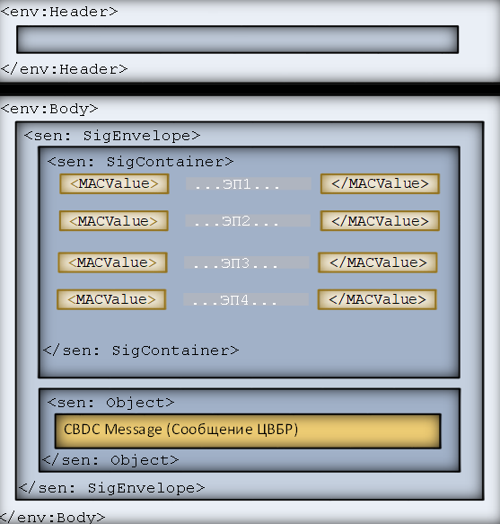

:sectnums:

include::../ContentElements/Title.adoc[]
:toc:
:toc-title: Содержание

== Глоссарий

include::../ContentElements/glossary.adoc[]

== Версии ЭС, используемые в Альбоме 2025.07

Обмен между участниками Системы ЦР осуществляется с применением следующих ЭС:

include::../Table/VersionEM.adoc[]
// Надо будет добавить ЭС

== Порядок обмена ЭС в Системе Цифрового рубля

Требования информационной безопасности в отношении технологии обработки и передачи электронных сообщений при осуществлении операций с цифровыми рублями Участником ПлЦР приведены в положении Банка России № 833-П.

=== Входной контроль

include::../Process/Process_1.adoc[]
include::../Process/Process_2.adoc[]

== Пример служебного конверта
[source, xsd]
include::../Examples/Envelope.xml[]

=== Структура служебного конверта

